# LIC-DSF Implementation Reference (External Debt Risk Rating Focus)

This document is a context-efficient substitute for the **IMF–World Bank LIC-DSF Guidance Note** and the **LIC-DSF Excel template** (IDA21 template vintage). It describes **how the framework actually works at implementation level**, prioritizing the **external debt risk rating** mechanics.

> [!tip] Principle Used Throughout
> When there is any ambiguity between narrative guidance and operational details, the **Excel template's formulas and selection logic are treated as authoritative**, because they are what generate the risk signals, charts, and outputs used in practice.

---

## 1) What the LIC-DSF Is and Why It Matters

### What It Is

The **Low-Income Country Debt Sustainability Framework (LIC-DSF)** is a standardized, jointly developed IMF–World Bank framework used to:

- Project public and publicly guaranteed (PPG) debt dynamics under a **baseline** scenario
- Run a set of **standardized stress tests** (plus tailored tests for specific vulnerabilities)
- Compare key debt burden indicators to policy **thresholds** (which depend on a country's **debt-carrying capacity**)
- Produce a **mechanical external debt distress risk rating** (Low / Moderate / High), plus an overall/public debt risk rating and space assessments

### Why It Matters (Policy Uses)

The LIC-DSF outputs are used operationally in:

- **IMF programs and surveillance** (program design, realism checks, debt limits, financing assurances)
- **World Bank/IDA operational terms** (e.g., IDA allocation and grant/credit mix, policy decisions)
- **Debt limits policies** and concessionality assessments
- Coordination among official creditors and engagement with borrowing authorities

### Signal Function Beyond Official Policy

Even though the DSF is an official-sector tool, its outputs often become a focal signal for:

- Private creditors and investors (risk perception, pricing)
- Rating agencies
- Domestic stakeholders (parliament, civil society)
- Debt transparency and debt management assessments

### Why the Excel Template is "The Authoritative Implementation"

The Guidance Note defines concepts and principles, but the **template** pins down operational details that matter for implementation fidelity, including:

- Exact **time windows** for historical averages and standard deviations
- Exact **shock calibration formulas** and their parameterization (including interaction elasticities)
- The **one‑year breach exclusion** and **one‑year spike discount** logic used in "most extreme shock" selection
- The **breach counting horizon** used by the mechanical signal
- How **residual financing** is constructed under stress

If you need to reproduce outputs, you must follow what the template does—not just what a narrative description suggests.

### Framework Components Overview

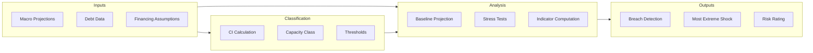

---

## 2) Architecture Overview

### End-to-End Flow

At a high level, the external module runs:

1. **Inputs** (macro, debt stocks & flows, new borrowing assumptions, coverage choices)
2. **Baseline projections** (debt stocks, PV, debt service)
3. **Stress tests** (standard B1–B6 + tailored; each re-computes a full projection)
4. **Debt burden indicators** (four external indicators)
5. **Thresholds** (depend on debt-carrying capacity class)
6. **Breach logic** (year-by-year comparisons, breach counts with one-year exclusion)
7. **Most extreme shock selection** (per indicator, with one-year spike discount)
8. **Mechanical external risk rating** (decision rule using breach flags)

### Architecture Diagram

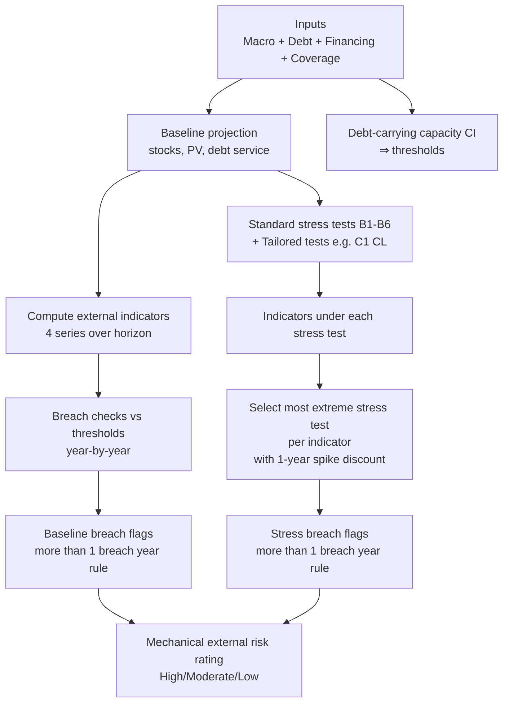

---

## 3) Time Axis Conventions

> [!warning] Year Notation Convention (Read This First)
> Throughout this document and the Excel template:
> - **t** = the **1st projection year** (e.g., 2024)
> - **t+1** = the **2nd projection year** (e.g., 2025) — *this is when most shocks BEGIN*
> - **t+2** = the **3rd projection year** (e.g., 2026) — *shocks typically continue here*
> 
> This notation can be confusing because "t+1" sounds like "one year after the start," but **t itself is already the first year**. So when stress tests are applied in "t+1 and t+2," they affect the **2nd and 3rd projection years**, not the 1st and 2nd.

The template has **two related but distinct "time anchors"**:

### 3.1 DSA Projection Timeline (Baseline + Stress Tests)

Define:

- **t** = the **first projection year** in the DSA baseline, shown in the template as the "start" projection year (e.g., `Macro‑Debt_Data!U4`)
- Historical years are **t−10 … t−1** (10 years)
- Projection years extend beyond that (commonly out to ~t+20 or further for charts), but **mechanical external risk logic focuses on an 11-year window** described below

**Historical SD window (for standard stress calibration):**

- **10 observations:** **t−10 … t−1**
- Implemented in baseline sheets as `STDEV( … )` over 10 historical columns (sample SD, ddof=1)

### 3.2 CI (Debt-Carrying Capacity) Timeline Anchor

The CI is calculated on a **10‑year window** of macro variables (5 historical + 5 "forward"), but **those forward years are not taken from the DSA macro baseline inputs**.

Define:

- **t_CI** = the "classification projection year" used for CI, stored as a template-controlled value (e.g., `Imported data!Q68`, named `DSF__CLASSIFICATION_PROJECTION_YEAR`)
- CI window is **t_CI−5 … t_CI+4** (10 consecutive years)

In the default template vintage, **t_CI typically equals t** (same calendar year), but conceptually the CI uses a *classification dataset*, not the DSA baseline.

### 3.3 The 10-Year vs 11-Year Distinction (Critical)

The template uses **different horizons for different mechanical operations**:

- **Shock ranking window (10 years):** **t+1 … t+10** (2nd through 11th projection years)
  Used to compute peaks and rank stress tests ("most extreme shock") per indicator.
  *Excludes t (1st year) because shocks don't apply there.*

- **Breach counting window for the mechanical signal (11 years):** **t … t+10** (1st through 11th projection years)
  Used to count threshold breaches for baseline and for the selected "most extreme shock."
  *Includes t (1st year) because even unshocked baseline values can breach.*

The template even labels the risk-rating horizon conceptually as: **"10 years (+ 1st yr proj)"**.

### Time Windows Diagram

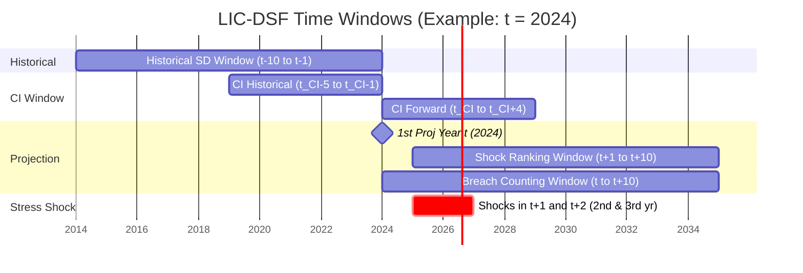

> [!note] Reading the Diagram
> If t = 2024 (1st projection year), then shocks are applied in 2025 (t+1, 2nd year) and 2026 (t+2, 3rd year).

---

## 4) Debt-Carrying Capacity (CI)

### 4.1 What the CI Is Used For

The CI determines the **debt-carrying capacity class**:

- **Weak**
- **Medium**
- **Strong**

That class selects the **external indicative thresholds** (PV/GDP, PV/Exports, DS/Exports, DS/Revenue), which in turn drive breach logic and the mechanical rating.

### 4.2 Where the CI Inputs Come From (Fixing a Common Confusion)

**In the template, the CI is *not* computed from the DSA macro baseline input sheet(s).**

Instead, the CI uses an **embedded/imported "classification" dataset** (WEO vintage–based macro series + CPIA), surfaced through:

- `Imported data` (lookup into internal tables via named ranges), and
- `CI Summary` (a transparent "calculation sheet" showing the CI math for the selected country)

Concretely:

- **The 5 "forecast" years in the 10‑year CI window come from the classification dataset** (WEO-vintage projections embedded in the template), **not from `Input 3 - Macro`**
- The template can be updated to a new vintage; CI then changes **with the vintage**, not with your DSA macro scenario edits

This is why CI behaves like a **country-vintage classification parameter** rather than an endogenous outcome of the DSA baseline.

### CI Data Source Diagram

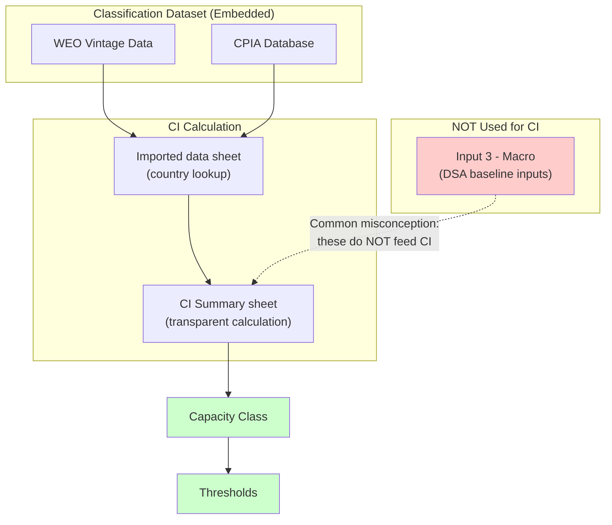

### 4.3 CI Window (Centered 10-Year Window)

Let **t_CI** be the CI anchor year (`DSF__CLASSIFICATION_PROJECTION_YEAR`). The CI uses:

- **10-year window:** **t_CI−5 … t_CI+4** (10 years total)
  - **5 historical years:** t_CI−5 … t_CI−1
  - **5 forward years:** t_CI … t_CI+4

In `CI Summary`, these years appear as a row of 10 year labels (e.g., 2019…2028 when t_CI=2024).

### 4.4 Components, Coefficients, and Exact CI Formula

The CI is a linear index:

- **CPIA** (level)
- **Real GDP growth** (percent)
- **Import coverage of reserves** (percent of annual imports)
- **Squared import coverage of reserves** (nonlinear penalty)
- **Remittances** (percent of GDP, capped)
- **World growth** (percent)

The coefficients (template "new framework") are:

| Component                         | Coefficient |
| --------------------------------- | ----------: |
| CPIA                              |       0.385 |
| Real GDP growth                   |       2.719 |
| Import coverage of reserves       |       4.052 |
| (Import coverage of reserves)²    |      -3.990 |
| Remittances                       |       2.022 |
| World growth                      |      13.520 |

### CI Calculation Flow

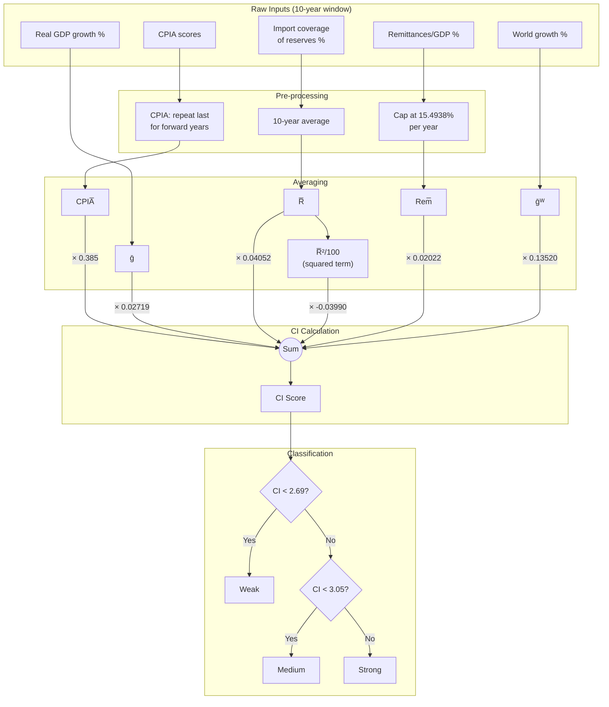

#### 4.4.1 Scaling Conventions (This Is Where Implementations Often Break)

The template applies a **percent scaling** to all non‑CPIA coefficients. Operationally, it computes:

- CPIA contribution: CI_CPIA = 0.385 × CPIA̅

- For variables entered as **percent numbers** (e.g., 4.8 meaning 4.8%), the template uses `coef% * avg`, i.e. coef/100.

So the template-equivalent CI expression is:

$$
CI = 0.385 \cdot \bar{CPIA} + \frac{2.719}{100} \cdot \bar{g} + \frac{4.052}{100} \cdot \bar{R} + \frac{-3.990}{100} \cdot \overline{R^2} + \frac{2.022}{100} \cdot \overline{Rem} + \frac{13.520}{100} \cdot \bar{g^W}
$$

where:

- ḡ is the 10-year average real GDP growth (in percent units)
- R̅ is the 10-year average import coverage of reserves (in percent units)
- Rem̅ is the 10-year average remittances/GDP (in percent units, **capped** as described below)
- ḡᵂ is the 10-year average world growth (in percent units)

#### 4.4.2 The Squared Reserves Term (The Most Common Bug)

The template does **not** compute "average of annual squared reserves coverage." It computes:

1. Compute the 10-year average reserves coverage R̅ (in percent units), then
2. Define the squared term as:

$$
\overline{R^2} = \frac{(\bar{R})^{2}}{100}
$$

This is exactly how the template produces values like:

- If R̅ = 31.76, then R̅² = 31.76²/100 ≈ 10.09

Equivalent interpretation (often clearer):

- Treat reserves coverage as a **share** (r = R̅/100), then r² enters the index
- The template's implementation is algebraically equivalent to using r² but expressed in percent-units bookkeeping

**Implementation takeaway:** If you represent reserves coverage as `0.3176` (a fraction), you square it directly. If you represent it as `31.76` (percent points), you must divide by 100 after squaring *and* remember coefficients are effectively divided by 100.

### 4.5 Remittances Cap (Template Detail That Matters)

In the CI calculation, remittances/GDP is **capped year-by-year** before averaging:

$$
Rem_{y}^{capped} = \min\left(100 \cdot \frac{Remittances_{y}}{GDP_{y}}, \; RemCap\right)
$$

The template uses a fixed cap value **RemCap = 15.4938** (percent of GDP).

Then:

$$
\overline{Rem} = \frac{1}{10}\sum_{y=t_{CI}-5}^{t_{CI}+4} Rem_{y}^{capped}
$$

### 4.6 CPIA Handling (Explicitly: "Most Recent CPIA" Rule)

CPIA has no forecasts. The template implements the forward CPIA years by **repeating the most recent observed CPIA score**:

- For years **t_CI … t_CI+4**, CPIA is set equal to CPIA at **t_CI−1** (the last historical CPIA year in the window)

So the 10-year CPIA average is literally:

- Average of the 5 historical CPIA values plus 5 copies of the last one

### 4.7 Cutoffs for Weak / Medium / Strong

The CI score maps to debt-carrying capacity:

- **Weak:** CI < 2.69
- **Medium:** 2.69 ≤ CI < 3.05
- **Strong:** CI ≥ 3.05

### 4.8 External Thresholds by Capacity Class

These thresholds apply to **PPG external** indicators:

| Capacity   | PV of external debt / GDP | PV of external debt / Exports | External DS / Exports | External DS / Revenue |
| ---------- | ------------------------: | ----------------------------: | --------------------: | --------------------: |
| **Weak**   |                        30 |                           140 |                    10 |                    14 |
| **Medium** |                        40 |                           180 |                    15 |                    18 |
| **Strong** |                        55 |                           240 |                    21 |                    23 |

### Threshold Selection Diagram

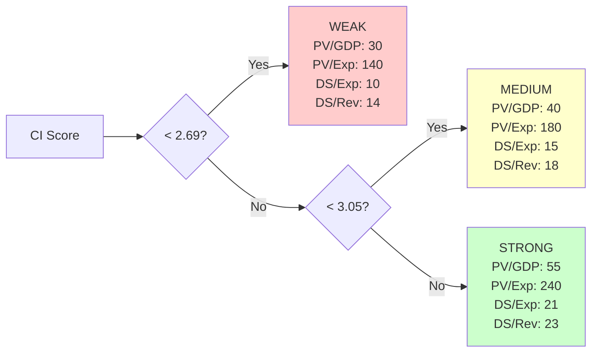

---

## 5) PV and Grant Element Mechanics

### 5.1 Discount Rate

The template uses a **fixed discount rate of 5%** for grant element and PV computations used in the LIC-DSF PV indicators:

$$
r = 0.05
$$

(Stored as a parameter in the template and referenced broadly.)

### 5.2 What "PV of Debt" Means in the Template

For LIC-DSF purposes, "PV of PPG external debt" is constructed as the **discounted value of future debt service** (principal + interest) streams associated with:

- **Existing** PPG external debt
- **New borrowing** assumed under the baseline/stress test borrowing paths and terms

evaluated on the template's annual time grid.

### 5.3 Timing Convention (Annual, End-of-Year Cashflows)

The implementation is consistent with an **annual period grid** where:

- Debt service cashflows in year t+k are treated as occurring at the end of that year
- Discounting uses integer year steps

A generic PV at evaluation year t takes the form:

$$
PV_t = \sum_{k=1}^{K} \frac{DS_{t+k}}{(1+r)^{k}}
$$

### PV Calculation Concept

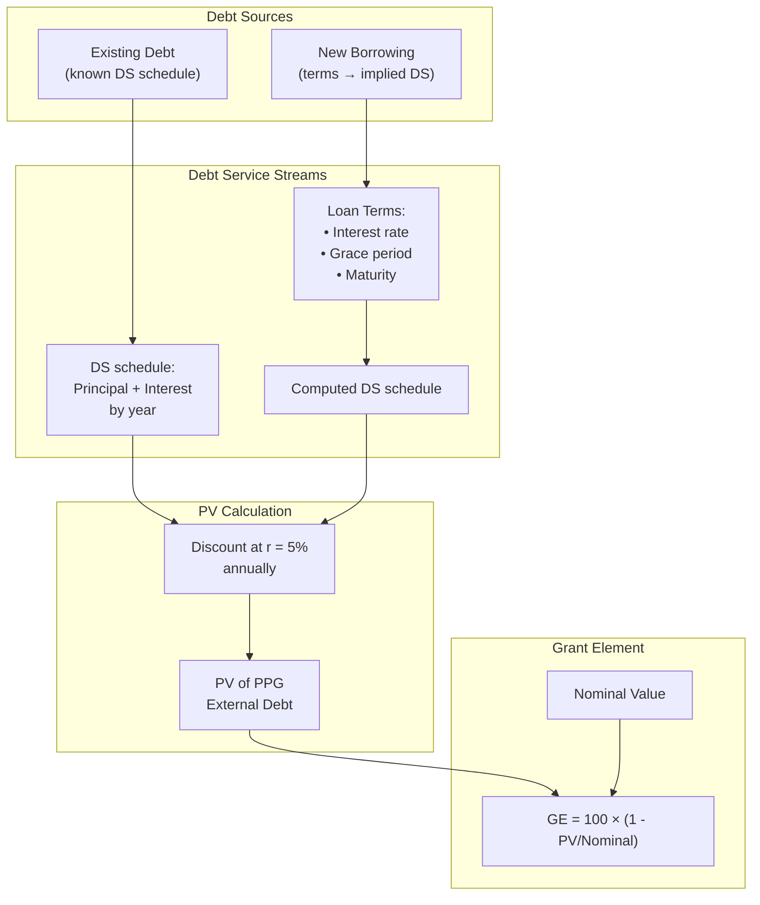

### 5.4 Existing Debt vs New Borrowing (How the Template Treats Them Differently)

#### Existing Debt

Existing debt is fed through an explicit **debt service schedule** (principal and interest by year) and discounted mechanically at r = 5%.

#### New Borrowing

New disbursements are turned into implied future debt service using assumed **loan terms**:

- Interest rate
- Grace period
- Maturity
- Amortization profile (template uses deterministic schedule logic consistent with its built-in repayment assumptions)

The PV of a unit disbursement is then computed as:

$$
PV = \sum_{k=1}^{K} \frac{principal_k + interest_k}{(1+r)^k}
$$

### 5.5 Grant Element

The template uses the standard grant element definition:

$$
GE = 100 \cdot \left(1 - \frac{PV}{Nominal}\right)
$$

"Nominal" here refers to the face value of the disbursement (or the nominal loan amount associated with the PV factor computation).

---

## 6) The Four External Indicators

All four indicators are computed for **PPG external debt** series:

1. **PV of PPG external debt / GDP**
   - **Solvency** indicator (stock burden relative to economy)

2. **PV of PPG external debt / Exports**
   - **Solvency** indicator (stock burden relative to external earnings capacity)

3. **PPG external debt service / Exports**
   - **Liquidity** indicator (flow burden relative to external earnings)

4. **PPG external debt service / Revenue**
   - **Liquidity** indicator (flow burden relative to fiscal capacity)

The template computes each indicator annually over the projection horizon under:

- Baseline
- Each stress test scenario
- And the "most extreme shock" path selected **separately for each indicator**

### Four Indicators Overview

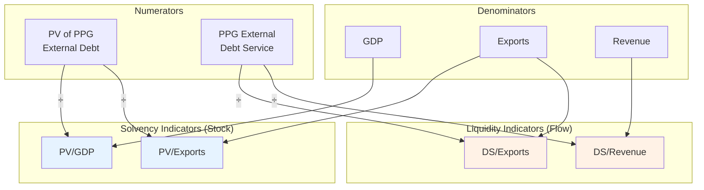

---

## 7) Standard Stress Tests (B1–B6): Implementation Specifications

### Global Conventions Used Across B-Tests

#### Shock Years

For standard tests, the adverse shock is applied in:

- **t+1 and t+2** — i.e., the **2nd and 3rd projection years**

> [!info] Why "t+1" means "2nd year"
> Because **t** is defined as the 1st projection year, **t+1** is the 2nd year and **t+2** is the 3rd year. The stress tests do **not** affect year t (the 1st projection year) in most cases — they begin in the 2nd year.

#### Historical Moments Used for Calibration

Unless a particular test says otherwise, calibration uses:

- **Historical average** and **historical sample SD** computed over **t−10 … t−1**

The template uses **sample SD** (`STDEV`), not population SD.

#### Calibration Choice ("Historical Only" vs "Baseline Only" vs "Whichever Is Lower")

The template parameterizes a calibration method, with default behavior effectively:

- **Whichever is lower** (default in "New" framework):
  For variables where a **lower value is worse**, the shocked level is:

$$
x^{shock}_{t+1} = \min(x^{base}_{t+1}, \bar{x}^{hist}) - k \cdot \sigma^{hist}
$$

where k is the shock size in SD units (typically k = 1).

**Template nuance:** The template chooses the method based on the year **t+1** (2nd projection year) comparison, then applies the same method to year **t+2** (3rd projection year). That is, if "hist−SD" is used in t+1, it is also used in t+2; if "baseline−SD" is used in t+1, it is also used in t+2.

### Stress Test Calibration Decision Tree

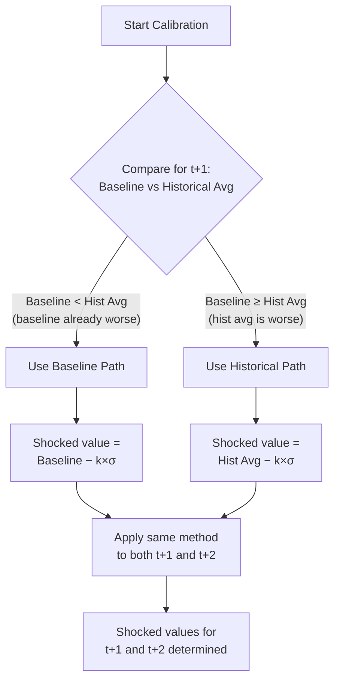

#### Interactions Toggle

The template has an "Interactions" switch (ON/OFF). When ON, certain shocks propagate into other macro variables using **fixed elasticities** stored in the standard test parameter sheet.

Key elasticities used in standard tests (when Interactions is ON):

- GDP growth shock → inflation/deflator adjustment: **0.6**
- Exports shock → GDP growth adjustment: **0.8**
- Depreciation shock:
  - Exchange-rate pass-through parameter: **0.3**
  - Net-exports/trade-balance elasticity: **0.15**

### Interaction Effects Diagram

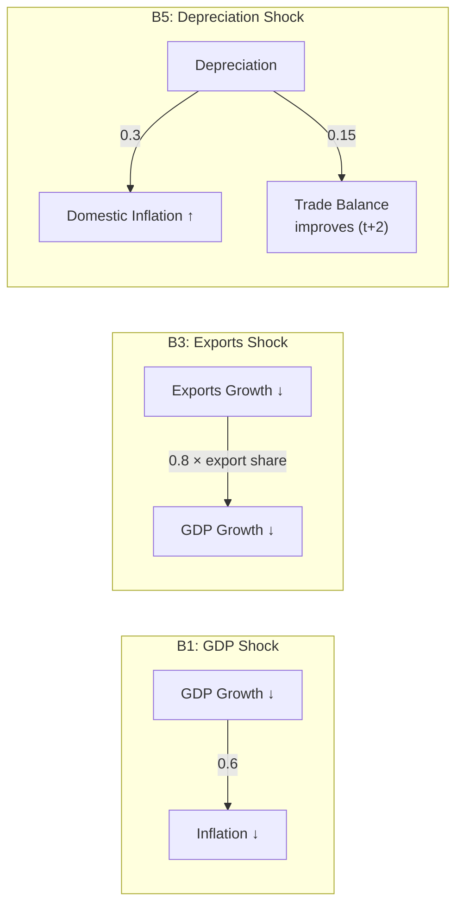

---

### B1: Real GDP Growth Shock

#### What Is Shocked

- **Real GDP growth rate** is reduced in years **t+1** and **t+2**

#### Calibration

Let:

- ḡʰⁱˢᵗ = historical average real GDP growth (t−10…t−1)
- σ_g = historical SD real GDP growth (sample SD)
- g^base_{t+1} = baseline growth in t+1
- k = shock magnitude in SD units (typically 1.0)

Then, under default "whichever is lower":

$$
g^{shock}_{t+1} = \min(g^{base}_{t+1}, \bar{g}^{hist}) - k \cdot \sigma_g
$$

Year **t+2** (3rd projection year) uses the same calibration branch chosen at t+1:

- If year t+1 used ḡʰⁱˢᵗ − k·σ_g, then g^shock_{t+2} = ḡʰⁱˢᵗ − k·σ_g
- Else g^shock_{t+2} = g^base_{t+2} − k·σ_g

#### Years Applied

- Shock applies in **t+1 and t+2** (the **2nd and 3rd projection years**)
- Years t+3 onward revert to baseline growth rates
- Year t (1st projection year) is **not** shocked

#### Interaction Effects (When ON)

GDP shock propagates to the GDP deflator/inflation measure used in nominal dynamics via elasticity **0.6**:

If baseline growth is higher than shocked growth by Δg = g^base − g^shock, then the template adjusts inflation/deflator growth downward by:

$$
\Delta \pi = 0.6 \cdot \Delta g
$$

so:

$$
\pi^{shock} = \pi^{base} - 0.6 \cdot (g^{base} - g^{shock})
$$

#### What Changes Downstream

- Nominal GDP (local and USD) paths change via real growth + deflator adjustments
- All ratios using GDP in the denominator update mechanically
- Debt dynamics adjust through the macro denominators and any residual financing needed to close identities

---

### B2: Primary Balance Shock (Pulled from Public Module)

#### What Is Shocked

- The **primary balance-to-GDP** (fiscal) path is worsened in **t+1 and t+2** (the **2nd and 3rd projection years**)

#### Why It "Comes from the Public Module"

Even for the **external** risk rating, the template's primary balance shock is implemented in the **public debt module**, then the external DSA ratios are recomputed consistently with:

- Higher financing needs
- The split between domestic and external financing
- And (for market-access countries) higher interest costs

This is why, in the chart/risk-rating assembly, the B2 external ratios are sourced through public-module computations.

#### Calibration Rule (Template Logic)

The template uses the same "whichever is lower minus SD" structure, but applied to **primary balance** (where **lower is worse** if PB is defined as surplus positive / deficit negative):

$$
PB^{shock}_{t+1} = \min(PB^{base}_{t+1}, \overline{PB}^{hist}) - k \cdot \sigma_{PB}
$$

Year **t+2** (3rd projection year) again follows the same branch chosen at t+1 (historical vs baseline).

#### Market vs Non-Market Variants

The template maintains separate B2 variants depending on market-financing status:

- **Non‑market**: primary balance worsens; financing adjusts via residual borrowing under baseline-type terms
- **Market-financing**: in addition, the template endogenously adds an interest rate premium on market borrowing linked to the fiscal deterioration (bounded by caps), increasing debt service and PV

(These variants matter for matching the template's exact outputs because they change both the borrowing path and the effective interest rates.)

---

### B3: Exports Shock

#### What Is Shocked

- **Exports growth** is reduced in **t+1 and t+2** (the **2nd and 3rd projection years**)

#### Calibration

Let:

- x̄gʰⁱˢᵗ = historical average exports growth
- σ_xg = historical SD exports growth

Then (default "whichever is lower"):

$$
xg^{shock}_{t+1} = \min(xg^{base}_{t+1}, \overline{xg}^{hist}) - k \cdot \sigma_{xg}
$$

Year t+2 (3rd projection year) follows the same branch choice as t+1.

#### Years Applied

- Exports growth is shocked in **t+1 and t+2** (2nd and 3rd projection years)
- Exports levels then evolve from that shocked growth; years t+3 onward use baseline growth
- Year t (1st projection year) is **not** shocked

#### Interaction Effects (When ON): Exports → GDP Growth

When Interactions are ON, the export shock feeds into GDP growth using:

- Elasticity **0.8**
- And an **export share scaling** (export-to-GDP ratio)

The template uses an important asymmetry:

- If **shocked exports growth becomes negative** in t+1, it applies a direct proportional adjustment using the negative growth rate itself
- Otherwise, it applies an adjustment proportional to the **difference** between baseline and shocked export growth

This asymmetry is a literal part of the template logic and affects GDP paths materially for large export shocks.

#### Downstream Propagation

- Exports level changes affect the export denominators directly (PV/exports, DS/exports)
- If interactions ON, GDP levels also change, affecting PV/GDP and revenue-related ratios

---

### B4: Other Flows Shock (Transfers + FDI)

#### What Is Shocked

Two non-debt-creating inflow components are reduced in **t+1 and t+2** (the **2nd and 3rd projection years**):

- **Net current transfers** (often entered with a sign convention as described below)
- **FDI** inflows

#### Calibration and Sign Conventions (Critical)

In the template's balance-of-payments style identities, these inflows are typically represented with a **negative sign** (because inflows reduce the need for debt-creating financing).

The shock reduces inflows; for a negative-valued inflow series, "reducing the inflow" means moving the number **up toward zero** (i.e., becoming **less negative**, which is numerically **larger**).

That is why the template uses a `MAX( … )` structure for these variables (because the "worse" value is the **larger** number when inflows are negative).

Implementation form (conceptual):

- Compute a positive-magnitude historical average and SD for the inflow
- Then set the shocked inflow to the **less negative** of:
  - (negative of (hist avg − SD)), or
  - (baseline inflow + SD)

#### Years Applied

- Shock applies in **t+1 and t+2** (2nd and 3rd projection years)
- Year t (1st projection year) is **not** shocked

#### Propagation

- Reduced transfers/FDI increase the external financing gap
- The template closes the gap via **residual financing** (additional borrowing), which increases external debt stocks and debt service and thus the indicators

---

### B5: Depreciation Shock (One-Time Nominal Depreciation + Macro Interactions)

#### What Is Shocked

- A **one-time nominal depreciation** of the domestic currency occurs in **t+1** (the **2nd projection year** only)

#### Depreciation Size

The template computes a depreciation magnitude (percent) using a rule of the form:

- **At least 30%**, and possibly larger depending on an overvaluation/adjustment term captured in the baseline and framework settings

So operationally:

$$
dep = \max(30, \text{rule-based value})
$$

#### Years Applied

- The nominal depreciation shock is applied in **t+1 only** (2nd projection year)
- Unlike other shocks, B5 does **not** extend to t+2
- Year t (1st projection year) is **not** shocked

#### Interaction Effects (When ON)

The template uses two key mechanisms:

1. **Pass-through to domestic inflation** (parameter 0.3)
   Only part of the depreciation translates into domestic prices; the remaining part shows up as a fall in USD deflators/real variables.

2. **Net exports / trade balance response** (elasticity 0.15)
   The template applies an adjustment to the **trade balance (imports − exports) as % of GDP** starting in **t+2** (the 3rd projection year), proportional to the computed **real depreciation**.

Conceptually (template sign convention uses trade deficit = imports − exports):

$$
(Imports - Exports)^{shock}_{t+2} = (Imports - Exports)^{base}_{t+2} - 0.15 \cdot RealDep_{t+1}
$$

So the trade deficit shrinks after a real depreciation.

#### Downstream Effects

- GDP and revenue denominators in USD may shift sharply in the depreciation year due to exchange-rate conversion and pass-through
- Debt service ratios vs revenue can worsen because revenue measured in USD falls with depreciation

---

### B6: Combination Shock (Half-Magnitude of B1–B5 Components)

The combination shock applies **simultaneously**:

- GDP growth shock (B1) at **half magnitude** (0.5× SD shock)
- Primary balance shock (B2) at **half magnitude**
- Exports shock (B3) at **half magnitude**
- Other flows shock (B4) at **half magnitude**
- Depreciation shock (B5) at **half magnitude**

Shock years follow the same structure:

- Growth/exports/flows/PB: **t+1 and t+2** (2nd and 3rd projection years)
- Depreciation: **t+1 only** (2nd projection year, half-size)
- Year t (1st projection year) is **not** shocked

Market vs non-market versions exist (like B2), because financing costs and residual financing differ.

### Standard Stress Tests Summary

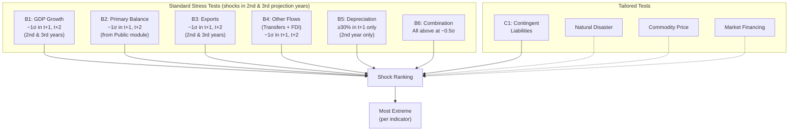

---

## 8) Historical Scenario (A1)

### What It Does

The historical scenario sets key macro/fiscal drivers to **historical averages** (rather than baseline projections) and recomputes the debt path and indicators.

In the template it is presented as an alternative path ("Historical scenario") alongside baseline and stress tests.

### Why It Is NOT Used for Mechanical Risk Signals

The template's mechanical external risk rating uses:

- Baseline breaches (after the one-year exclusion rule), and
- Breaches under the **"most extreme shock"** selected from **standard + tailored stress tests**

The historical scenario A1 is **not included** in the "most extreme shock" selection range and is therefore excluded from the mechanical signal.

### A1 Exclusion Diagram

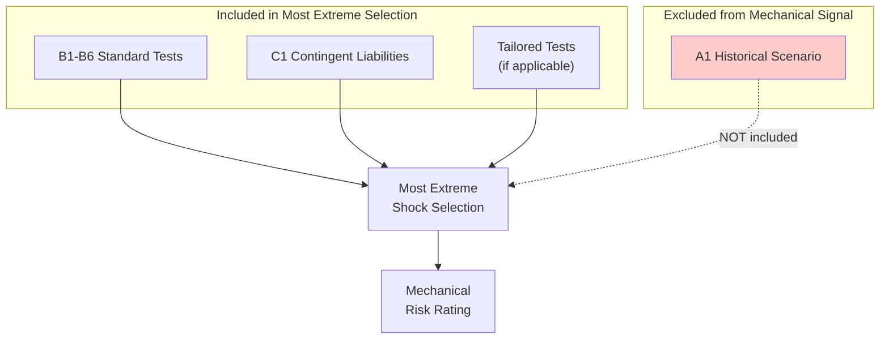

---

## 9) Contingent Liabilities Stress Test (C1)

### What It Is

The contingent liabilities (CL) test adds a **one-time increase in public debt** (and associated financing needs) to reflect potential realization of contingent obligations not captured in the debt perimeter.

### Components and Sizing Rules (Template Defaults)

The template constructs the CL shock as the sum of components (percent of GDP):

1. **Explicit guarantees / other contingent liabilities**
   - User-input (default may be 0)

2. **SOE-related contingent liabilities**
   - Default **2% of GDP**

3. **PPP contingent liabilities**
   - **35% of PPP stock** (PPP stock as % of GDP)
   - Applied only if PPP stock exceeds a trigger threshold (template uses a >3% rule for activation)

4. **Financial sector contingent liabilities**
   - Default **5% of GDP**

Total CL shock:

$$
CL = Guarantees + 2 + 0.35 \cdot PPP_{stock} \text{ (if triggered)} + 5
$$

### C1 Contingent Liabilities Calculation

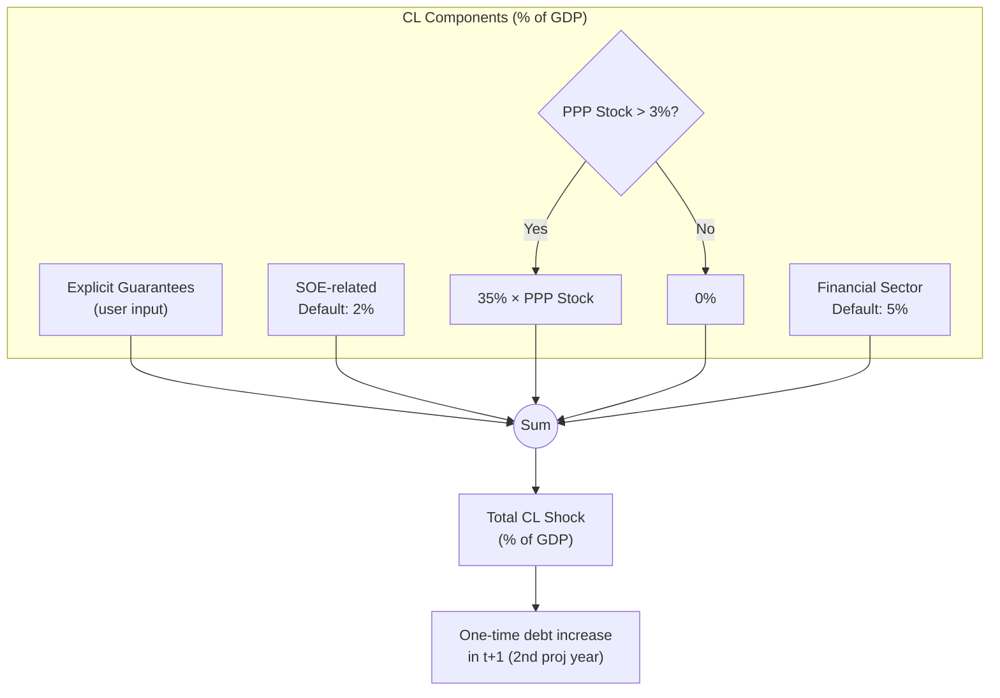

### When It Is Included in "Most Extreme Shock" Selection

C1 is included among the candidate stress tests for "most extreme shock" ranking **for each indicator**, meaning it can determine the "most extreme" path if it generates the highest (or highest adjusted) peak.

---

## 10) "Most Extreme Stress Test" Selection Logic

The template selects a "most extreme shock" **separately for each indicator** (PV/GDP, PV/exports, DS/exports, DS/revenue).

### 10.1 Candidate Set

The candidate set includes:

- B1–B6 standard tests (as applicable)
- C1 contingent liabilities
- Tailored tests (natural disaster, commodity, market financing) if applicable
- Plus any customized scenario row (for charting)

A1 (historical scenario) is **not** in the candidate set used for most-extreme selection.

### 10.2 Ranking Window (10 Years)

For ranking stress tests, the template computes each scenario's "peak" over:

- **t+1 … t+10** (the **2nd through 11th projection years**)

Note: This excludes year **t** (the 1st projection year) from the peak calculation.

### 10.3 One-Year Spike Discount Rule (Exact Template Behavior)

This rule prevents a shock that produces a **single-year breach spike** from mechanically dominating the "most extreme" selection.

The template logic can be described as:

1. Compute, for each scenario s, over the 10-year ranking window:
   - Peak_s = max(Indicator for s over t+1 to t+10)
   - BreachCount¹⁰_s = number of years y in [t+1, t+10] where Indicator_{s,y} > Threshold_y

2. Also compute whether the **first projection year** (t) breaches:
   - Breach_t = 1 if Indicator_{s,t} > Threshold_t, else 0

3. Identify "one-year-only breach" scenarios as those with:
   - BreachCount¹⁰_s = 1 **and** Breach_t = 0
     (so total breaches in the 11-year window t…t+10 equals exactly 1)

4. If at least one "one-year-only breach" scenario exists:
   - For those scenarios, replace the ranking metric with:
     - Peak^adj_s = 2nd Largest(Indicator for s over t+1 to t+10)
   - For all other scenarios, use:
     - Peak^adj_s = Peak_s

5. Rank scenarios by Peak^adj_s (descending). The **rank = 1** scenario is selected as "most extreme."

### One-Year Spike Discount Logic

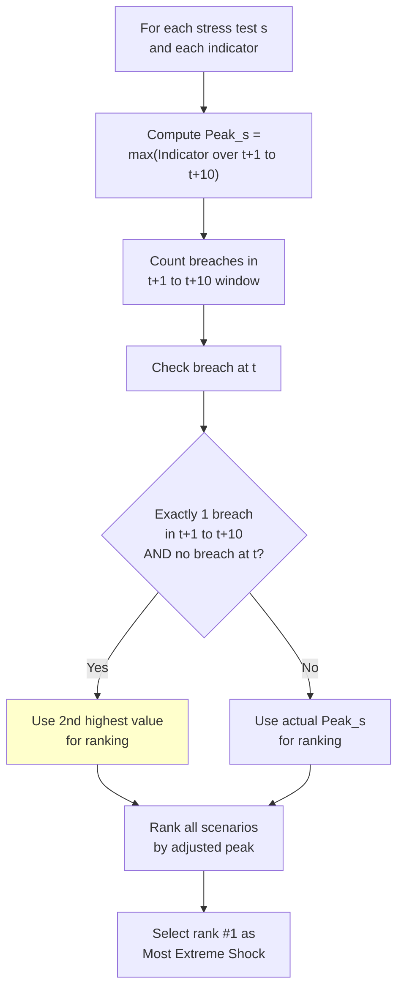

### 10.4 Tie-Breaking Behavior

The template uses Excel's `RANK` plus `MATCH(1, …)` selection pattern. When multiple scenarios tie for rank 1, `MATCH` returns the **first** occurrence in the candidate list. Thus, tie-breaking is effectively determined by the **row order** of stress tests in the chart-data tables.

### 10.5 Output

For each indicator, the template then constructs:

- A "most extreme shock" **time series** used in charts
- Breach flags for that series used in mechanical risk logic (see next section)

---

## 11) Breach Counting and the One-Year Exclusion Rule

### 11.1 Breach Definition (Year-by-Year)

For an indicator series I_y and threshold T_y:

$$
B_y = \begin{cases} 1 & \text{if } I_y > T_y \\ 0 & \text{otherwise} \end{cases}
$$

(Strict "greater than" in the template comparison logic.)

### 11.2 Breach Counting Horizon (11 Years)

For the mechanical external risk rating, breach counts are computed over:

- **t … t+10** (the **1st through 11th projection years** — 11 years total)

This includes the first projection year **t** plus the next ten years. Note that while shocks are applied in t+1 and t+2 (2nd and 3rd years), breach counting starts from t (1st year).

### 11.3 One-Year Exclusion Rule (Mechanical Signal)

The template applies a **hard mechanical exclusion**:

- If the number of breach years is **0 or 1**, it is treated as **no breach** for the mechanical rating signal
- Only if breaches occur in **2 or more years** is it treated as a breach for the mechanical rating signal

Formally, define:

$$
Count = \sum_{y=t}^{t+10} B_y
$$

Then the breach flag used by the mechanical signal is:

$$
Flag = \begin{cases} 1 & \text{if } Count > 1 \\ 0 & \text{otherwise} \end{cases}
$$

This rule is applied:

- To baseline indicator paths (baseline breach flag)
- And to "most extreme shock" indicator paths (stress breach flag)

**separately for each of the four indicators**.

### Breach Counting and Exclusion Logic

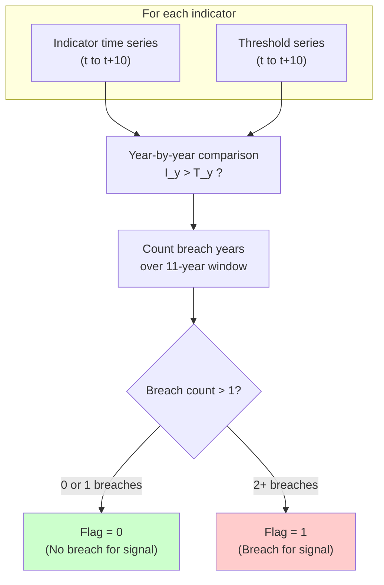

---

## 12) Mechanical External Risk Rating Logic

The template's mechanical external risk rating is a **three-level decision** based on:

- Baseline breaches (after the one-year exclusion rule), and
- Stress breaches under the selected "most extreme" shock (after the one-year exclusion rule)

### Decision Rule (Exact Template Logic)

Let:

- `BaselineBreach` = 1 if **any** of the four indicators has Count_baseline > 1
- `StressBreach` = 1 if **any** of the four indicators has Count_mostExtreme > 1

Then:

- If `BaselineBreach = 1` ⇒ **HIGH**
- Else if `BaselineBreach = 0` and `StressBreach = 1` ⇒ **MODERATE**
- Else ⇒ **LOW**

### Rating Flowchart

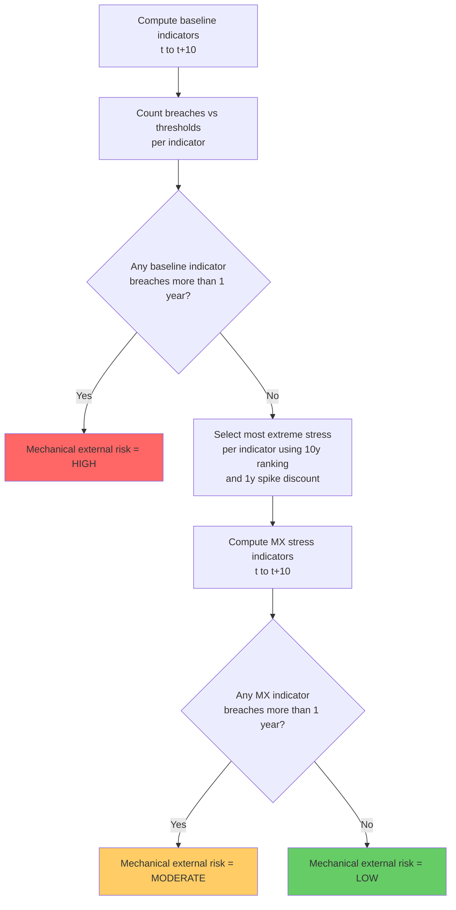

**Important nuance:** "Most extreme" is selected **per indicator**, so the stress test driving PV/GDP may differ from the stress test driving DS/Revenue.

### Complete Risk Rating Decision Tree

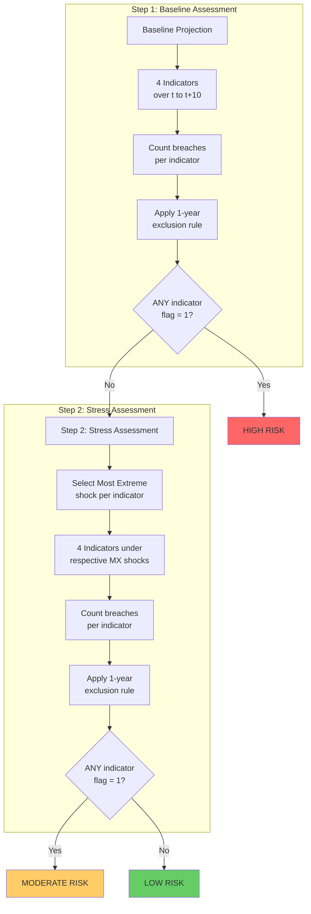

---

## 13) Residual Financing Under Stress

### Why Residual Financing Matters

Most stress tests create accounting gaps:

- Weaker growth lowers GDP and revenue in USD
- Lower exports/transfers/FDI weaken the current account
- Fiscal shocks worsen deficits
- Depreciation changes nominal conversions and trade balances

To keep the model consistent, the template closes these gaps via **residual financing** rules. These rules materially affect:

- Debt stocks
- PV of debt
- Debt service paths
- And thus the indicators and breaches

### Residual Financing Flow

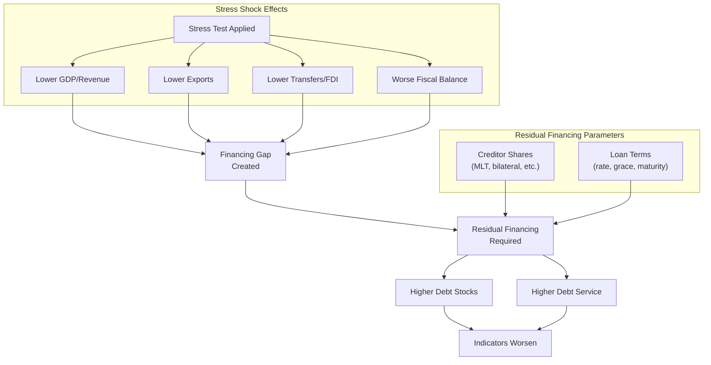

### How the Template Fills Financing Gaps

Under stress, the template typically:

1. Preserves programmed borrowing/disbursements implied by baseline assumptions (unless the shock directly affects them)
2. Computes the additional financing need implied by the shock
3. Fills the additional need with **residual borrowing**, with:
   - A composition across creditor categories (e.g., multilateral/bilateral/commercial)
   - Assumed terms (interest, grace, maturity)
   - And associated PV factors and debt service schedules

### Where Residual Financing Parameters Come From

Default residual financing settings are pulled from baseline financing/debt data modules (external and domestic), but the template provides an explicit **override interface** in:

- `Input 7 - Residual Financing`

This sheet contains:

- Shares for residual external PPG MLT borrowing across creditor types
- Average terms (interest rate, grace, maturity)
- And analogous settings for domestic residual financing

These parameters are used by the stress-test machinery to match the template's accounting and outputs.

---

## 14) Key Excel Implementation Details

### 14.1 Standard Deviation Is Sample SD

Whenever "historical SD" is used, the template uses:

- Excel `STDEV( … )` (sample SD, ddof=1)
- Not `STDEV.P`

### 14.2 Core Sheets and Their Roles (External Risk Rating Path)

A minimal mental map:

- **`Input 1 - Basics`**
  Core identifiers, framework switches, discount rate.

- **`Input 2 - Debt Coverage`**
  Debt perimeter, contingent liabilities test sizing inputs.

- **`Macro-Debt_Data`**
  Macro time series feeding baseline and stress dynamics.

- **`Ext_Debt_Data`**
  External debt stocks, flows, and financing composition inputs.

- **`Input 6(optional)-Standard Test`**
  Standard stress test parameters (k's, calibration mode, elasticities, interaction ON/OFF).

- **`CI Summary`**
  Transparent CI computation for selected country based on **Imported data**.

- **`Imported data` and `Classification`**
  Embedded datasets (WEO vintage & CPIA) and country classification.

- **`Baseline - external`**
  Baseline external DSA paths and derived series; historical moments for shocks.

- **`B1_GDP_ext`, `B3_Exports_ext`, `B4_other flows_ext`, `B5_depreciation_ext`, `B6_combo_*_ext`**
  Stress test scenario engines (external).

- **Public-module stress sheets for B2/B6 variants**
  Compute fiscal-driven stress paths that feed external ratios.

- **`Chart Data`**
  **Authoritative mechanical logic**: breach year flags, breach counts, one-year exclusion rule, most extreme shock selection (per indicator), mechanical risk rating signal.

- **`Output 7 - Risk rating summary`**
  Displays the mechanical rating result computed in Chart Data.

### Template Sheet Flow Diagram

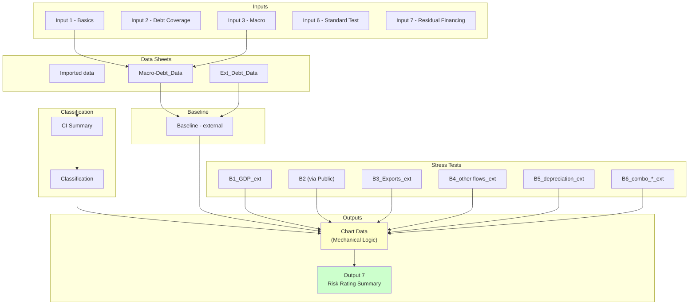

### 14.3 Where the Mechanical External Rating "Lives"

Mechanically, the external risk rating is computed in **Chart Data** and surfaced elsewhere. The final label is a lookup of a numeric code driven by:

- Baseline breach flag (OR across indicators)
- Stress breach flag (OR across indicators)

### 14.4 Market vs Non-Market Variants

Market-financing status changes which scenario sheets are used for:

- B2 primary balance shock
- B6 combination shock
- And potentially tailored market-financing shocks

This affects interest rate dynamics and residual financing assumptions, so it can change both PV and DS profiles.

---

## 15) Inputs Contract (What You Must Have to Run the External Risk Rating)

To reproduce the external risk rating mechanics, inputs must be sufficient to generate, at minimum:

### 15.1 Country/Vintage Classification Inputs (CI / Thresholds)

The template requires:

- CPIA score (latest available; projected years repeat it)
- Classification macro series for the 10-year CI window (growth, reserves, remittances, world growth)
- The CI anchor year **t_CI** (classification projection year)
- Mapping to capacity class and thresholds

In the template, these are embedded via `Imported data` and `Classification`.

### 15.2 Macro Projection Inputs for the DSA Baseline (t… Horizon)

Baseline and stress dynamics depend on:

- Real GDP growth
- GDP deflator / inflation measures used for nominal conversions
- Exchange rate and/or USD conversion series
- Exports and imports (levels or shares and growth rates)
- Fiscal aggregates relevant for revenue and primary balance
- BOP items relevant for debt accumulation identities (transfers, FDI, etc.)

### 15.3 External Debt Stock and Debt Service Schedules

For PPG external debt:

- Initial debt stock (by instrument/creditor class as required by template)
- Projected debt service schedules (principal + interest) for existing debt
- New borrowing assumptions (disbursements) and terms:
  - Interest rate
  - Grace
  - Maturity
  - Composition shares

### 15.4 Coverage Choices That Affect "External" Classification

The external module classification depends on whether external is defined on:

- **Residency basis** (default: nonresidents)
- vs currency-based or other alternative definitions if the template is configured that way

This choice affects which liabilities are treated as "external" vs "domestic" and therefore changes the indicator numerators and debt service series.

### 15.5 Residual Financing Settings Under Stress

To match stress-test outputs, you need:

- Residual financing shares and terms (external and domestic)
- Because shocks create financing gaps that are closed endogenously

The template exposes these via `Input 7 - Residual Financing`.

### Inputs Contract Summary

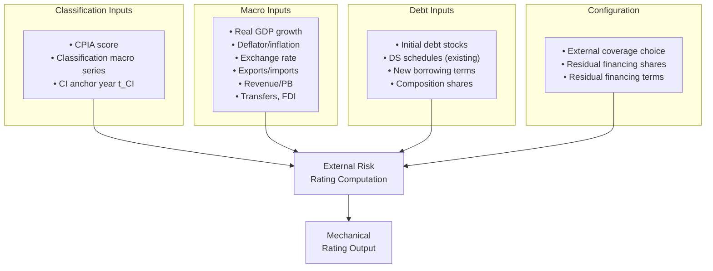

---

## Brief Note on Overall/Public Debt Rating

The overall/public debt risk rating follows analogous mechanics:

- A baseline path and stress tests in the public module
- Comparison to public debt benchmarks/thresholds
- Breach logic and mechanical signals

but with different indicator sets and additional fiscal/market-financing dynamics. The external rating described above is the primary focus here; the public rating is assembled similarly but from the public DSA tables and their associated Chart Data block.

---

## Appendix: Compact Notation Summary

| Symbol/Term | Definition |
|-------------|------------|
| **t** | 1st projection year (e.g., 2024 in `Macro‑Debt_Data!U4`) |
| **t+1** | 2nd projection year — **where most shocks BEGIN** |
| **t+2** | 3rd projection year — **where most shocks CONTINUE** |
| **Historical SD window** | t−10 … t−1 (10 years before 1st projection year) |
| **Stress shock years (standard tests)** | t+1 and t+2 (2nd and 3rd projection years) |
| **Shock ranking window ("most extreme")** | t+1 … t+10 (2nd through 11th projection years) |
| **Breach counting window (mechanical signal)** | t … t+10 (1st through 11th projection years) |
| **One-year exclusion** | Breach count ≤ 1 ⇒ treated as no breach |
| **t_CI** | CI anchor year (`DSF__CLASSIFICATION_PROJECTION_YEAR`) |
| **CI window** | t_CI−5 … t_CI+4 (10 years; 5 historical + 5 forward from classification dataset) |

> [!warning] Year Notation Reminder
> **t is the 1st projection year**, so t+1 is the 2nd year and t+2 is the 3rd year. Stress tests affect the 2nd and 3rd years, not the 1st.

---

## Appendix: Quick Reference Diagrams

### End-to-End Process Overview

```mermaid
flowchart LR
    subgraph "1. Setup"
        A1[Load Inputs]
        A2[Calculate CI]
        A3[Set Thresholds]
    end
    
    subgraph "2. Baseline"
        B1[Project Debt]
        B2[Compute Indicators]
        B3[Check Breaches]
    end
    
    subgraph "3. Stress"
        C1[Run B1-B6 + Tailored]
        C2[Compute Indicators]
        C3[Select Most Extreme]
        C4[Check Breaches]
    end
    
    subgraph "4. Rating"
        D1{"Baseline<br>Breach?"}
        D2{"Stress<br>Breach?"}
        D3[Assign Rating]
    end
    
    A1 --> A2 --> A3 --> B1 --> B2 --> B3 --> C1 --> C2 --> C3 --> C4 --> D1
    D1 -->|Yes| D3
    D1 -->|No| D2
    D2 --> D3
```

### Key Decision Points Summary

```mermaid
flowchart TD
    subgraph "CI Classification"
        CI_VAL[CI Value] --> CI_D1{"< 2.69?"}
        CI_D1 -->|Yes| WEAK[Weak]
        CI_D1 -->|No| CI_D2{"< 3.05?"}
        CI_D2 -->|Yes| MED[Medium]
        CI_D2 -->|No| STRONG[Strong]
    end
    
    subgraph "Breach Exclusion"
        COUNT[Breach Count] --> BR_D{"Count > 1?"}
        BR_D -->|"0 or 1"| NO_BR[No Breach Flag]
        BR_D -->|"2+"| YES_BR[Breach Flag]
    end
    
    subgraph "Risk Rating"
        BASE_FL[Baseline Flag] --> RATE_D1{"Flag = 1?"}
        RATE_D1 -->|Yes| HIGH[High]
        RATE_D1 -->|No| STRESS_FL[Stress Flag]
        STRESS_FL --> RATE_D2{"Flag = 1?"}
        RATE_D2 -->|Yes| MODERATE[Moderate]
        RATE_D2 -->|No| LOW[Low]
    end
    
    style WEAK fill:#ffcccc
    style MED fill:#ffffcc
    style STRONG fill:#ccffcc
    style HIGH fill:#ff6666
    style MODERATE fill:#ffcc66
    style LOW fill:#66cc66
```
