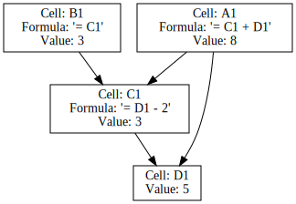

# Deliverable Documentation: How the LIC DSF programmatic extraction pipeline works

Created by: Christopher Smith
Created time: January 30, 2026 3:16 PM
Date: January 30, 2026
Owner: Christopher Smith
Status: Reference
Summary: The LIC DSF programmatic extraction pipeline consists of four main components: excel-grapher for dependency tracing, excel-formula-expander for translating Excel formulas to Python, lic-dsf-programmatic-extraction for enhancing the output with economic logic, and py-lic-dsf as the public-facing library for running scenarios. Key challenges include cycle detection, dynamic range resolution, and ensuring semantic parity between Excel and Python implementations. The pipeline aims to produce readable and usable Python code from complex Excel workbooks while maintaining efficiency and accuracy in computations.
Type: Deliverable, Documentation
Linear Initiatives: Build Production-Grade LIC DSF Climate Scenario Tool for Uganda MoF for Spring IMF/WB Meetings (https://www.notion.so/Build-Production-Grade-LIC-DSF-Climate-Scenario-Tool-for-Uganda-MoF-for-Spring-IMF-WB-Meetings-2a21251ca79e802a845de921757d901d?pvs=21)

# How our Excel reverse-engineering pipeline works

- [Project overview](about:blank#project-overview)
    - [`excel-grapher`](about:blank#excel-grapher)
        - [Objective](about:blank#objective)
        - [Implementation](about:blank#implementation)
        - [Hard problems encountered](about:blank#hard-problems-encountered)
    - [`excel-formula-expander`](about:blank#excel-formula-expander)
        - [Objective](about:blank#objective-1)
        - [Non-goals (for now)](about:blank#non-goals-for-now)
        - [Implementation](about:blank#implementation-1)
        - [Architectural decisions](about:blank#architectural-decisions-1)
        - [Hard problems encountered](about:blank#hard-problems-encountered-1)
    - [`lic-dsf-programmatic-extraction`](about:blank#lic-dsf-programmatic-extraction)
        - [Objective](about:blank#objective-2)
        - [Implementation](about:blank#implementation-2)
        - [Architectural Decisions](about:blank#architectural-decisions-2)
        - [Hard Problems Encountered](about:blank#hard-problems-encountered-2)
    - [`py-lic-dsf`](about:blank#py-lic-dsf)
        - [Objective](about:blank#objective-3)
        - [Implementation](about:blank#implementation-3)
        - [Architectural decisions](about:blank#architectural-decisions-3)
        - [Hard problems encountered](about:blank#hard-problems-encountered-3)

# Project overview

The LIC DSF Excel reverse-engineering pipeline consists of four repositories:

1. [excel-grapher](https://github.com/Teal-Insights/excel-grapher) -
Maps and extracts cells required to compute some set of target output cells
2. [excel-formula-expander](https://github.com/Teal-Insights/excel-formula-expander) -
Translates Excel formulas from the `excel-grapher` graph into Python code and either runs them directly or exports them as a library
3. [lic-dsf-programmatic-extraction](https://github.com/Teal-Insights/lic-dsf-programmatic-extraction) -
Configures and post-processes the export to make it less Excel-shaped and more economic logic-shaped
4. [py-lic-dsf](https://github.com/Teal-Insights/py-lic-dsf) - The
final output, a Python library that can be used to run the LIC DSF shock scenarios

## `excel-grapher`

### Objective

The goal of our first layer, `excel-grapher`, is **target-driven dependency tracing**. That is, to identify which cells are needed as dependencies in order to compute some given set of target output cells.

The core function, `create_dependency_graph()`, takes a list of Excel cell or range addresses as `targets` and returns a `DependencyGraph`:

```python
graph = create_dependency_graph(
    "example.xlsm",
    ["Sheet1!A1:Sheet1!A2"]
)
```

We can then add Python translation functionality to this graph in the next layer, `excel-formula-expander`.

### Implementation

### High-level overview

We have three main components to our implementation:

1. **Parsing**: For each target cell, we use regex to detect cell/range references in its formula. Then we repeat for each referenced cell. And so on, until we reach the “leaves” of the dependency tree (non-formula cells or formula cells that don’t reference other cells).
2. **Graph construction**: We build a directed graph of the dependencies, where each cell is a node, and each edge is a dependency.
3. **Visualization**: We also provide a few helpers to export the graph to mermaid, graphviz, or networkx formats for visualization.

### Core data model

The core data model for representing the graph is simple: we have a `DependencyGraph` class with `_nodes` and `_edges` dictionaries.

```python
from dataclasses import dataclass, field
from typing import Any

# Simplified data models

NodeKey = str  # Always in the form "SheetName!A1" or "'Sheet Name'!A1" for quoted sheets

@dataclass
class Node:
    sheet: str
    column: str
    row: int
    formula: str | None = None
    normalized_formula: str | None = None
    value: Any = None

@dataclass
class DependencyGraph:
    _nodes: dict[NodeKey, Node] = field(default_factory=dict)
    _edges: dict[NodeKey, set[NodeKey]] = field(default_factory=dict)
```

To add a cell to the graph, we add one entry to `_nodes` and one entry to `_edges` for the cell. Each entry is keyed by the cell’s `NodeKey`, its Excel cell address string. We standardize all addresses to the sheet-prefixed form `"SheetName!A1"` (or `"'Sheet Name'!A1"` for sheet names with spaces, hyphens, or apostrophes).

In `_nodes`, the value of the added dictionary entry is a `Node` object, which contains the cell’s address information (sheet, column, row), its formula, and its cached value. We also produce a normalized version of the formula that uses our canonical Excel cell address format.

In the `_edges` dictionary, meanwhile, the value of the dictionary entry for each key is a set of `NodeKey` addresses of the cells referenced in this cell’s formula.

Suppose we have a workbook with a single sheet and three cells:

| A1 | B1 | C1 |
| --- | --- | --- |
| =B1+C1 | 2 | 3 |

Each cell would have `_nodes` and `_edges` entries in the `DependencyGraph`. Here’s what the data looks like:

```
Nodes:
{'Sheet1!A1': Node(sheet='Sheet1',
                   column='A',
                   row=1,
                   formula='=B1+C1',
                   normalized_formula='Sheet1!B1+Sheet1!C1',
                   value=5),
 'Sheet1!B1': Node(sheet='Sheet1',
                   column='B',
                   row=1,
                   formula=None,
                   normalized_formula=None,
                   value=2),
 'Sheet1!C1': Node(sheet='Sheet1',
                   column='C',
                   row=1,
                   formula=None,
                   normalized_formula=None,
                   value=3)}

Edges:
{'Sheet1!A1': {'Sheet1!C1', 'Sheet1!B1'}, 'Sheet1!B1': {}, 'Sheet1!C1': {}}
```

The real implementation is a bit more complicated, but these are the
basics.

### Architectural decisions

1. **Separate repositories for `excel-grapher` and `excel-formula-expander`, with dependency detection (using regex) happening first, and formula translation (using AST-parsing) happening second**
    - I separated these to make them easier to reason about, but some other libraries (like `formulas`) do both in a single pass, which might be a bit faster or more efficient.
    - As you’ll see below, I had to partially implement a few functions in the `excel-grapher` repo to support cycle detection and dynamic range resolution. Maybe having had access to the full formula AST during dependency detection would have made it easier to handle those edge cases.
2. **Canonicalizing named ranges**
    - Excel lets users define “named ranges” (aliases for Excel addresses) and use them in formulas.
    - `fastpyxl` offers a helper for getting the full list of named ranges for the workbook.
    - We construct a dictionary of named ranges to their canonical addresses, and then substitute the canonical addresses in the `normalized_formula` field of each `Node` during extraction.
3. **Callback hooks for adding node metadata**
    - Since I knew we’d later want to do some things like detect row and column labels and add them to the node, I added a `metadata` field to the `Node` class.
    - I also added a `register_hook()` method to the `DependencyGraph` class, for adding arbitrary functions that run after a node is added to the graph.
    - Essentially, this makes the process of building the graph configurable and extensible.
4. **Shared dependency graph for multiple targets**
    - Excel only computes each cell value in the workbook once, and we want to emulate that behavior.
    - So when the user has multiple output targets, we need to share the same dependency graph between them, such that any given dependency node only appears once even if it’s referenced by multiple targets.
    - This makes the computation **more efficient**, but it makes it **harder to reason about** what the data flow is for any single target.
    - I don’t currently expose helpers for getting the subgraph for any single target or set of targets, but that’s something we’ll definitely want to add for interpretability.



Graphviz visualization of simplified four-cell workbook with two targets: A1 and B1

Note: Both top-level targets share a single dependent C1 node, which is only computed once. D1 is required for A1, but not for B1.

### Hard problems encountered

1. **Cycle detection**
    - I did an extensive writeup on this problem in [Notion](https://www.notion.so/Rough-Notes-Learnings-from-Working-with-Excel-Internals-2e21251ca79e803698def9a3991e2e47?pvs=21).
    - The LIC DSF workbook has circular dependencies **disabled**, which means Excel will never iterate cycles; it will always just return `0` for any cell already seen in the same formula chain.
    - **After formula translation to Python code**, it’s easy to imitate this behavior when running the code for any particular set of inputs.
    - It’s much harder to predict ahead of time, via static analysis, whether cycles will ever occur for arbitrary inputs.
    - I implemented *some* logic to try to solve this, but I ultimately decided this is not a guarantee that `excel-grapher` needs to provide (since the Excel workbook itself doesn’t provide this guarantee), so it’s not a problem worth the effort to solve.
    - I *think* the reason the `formulas` library takes so long to run is because it’s actually trying to solve this problem by running the code for different combinations of inputs.
2. **Dynamic range resolution**
    - There are a couple Excel formulas, `OFFSET` and `INDIRECT`, where regex doesn’t cut it for identifying the dependency cells.
    - For example, `OFFSET(B1,0,1,1,1)` means “start at cell B1, move 1 column to the right, and return a 1x1 range starting at that new cell”. Which means the cell you actually need as a dependency is
    C1, not B1.
    - This is easy enough to handle if all the offset arguments are literal values, but it’s much harder if they’re formulas themselves.
        - For instance, `OFFSET(B1,0,A1,1,1)` means “start at cell B1, move A1 columns to the right, and return a 1x1 range starting at that new cell”. Now you need to resolve A1 to get the actual dependency cell.
        - And what if A1 is an input or formula that might change arbitrarily? Then we’d need to add every cell in the row as a dependency, just to be safe.
    - I’m currently handling this by using the cached values from the workbook to resolve the dynamic references. For instance, for the example above, we’d look up the last computed value of A1 and use that as the offset. But this is not a perfect solution, and we need a better fix.

## `excel-formula-expander`

### Objective

The goal of our second layer, `excel-formula-expander`, is **formula translation and execution**. That is, we want to **translate Excel formulas from a `DependencyGraph` into functionally equivalent Python code**.

### Goals

- Support ~32 Excel functions used in target workbook
- Execute Excel formulas with correct semantics
- Compute each cell only once, even if it’s required for multiple target outputs
- Match Excel’s behavior of returning 0 for cells already seen in the same formula chain (and raise a warning)
- Support either running the full formula chain directly from the graph or exporting it as a standalone library, and enforce parity between the two paths

### Non-goals (for now)

- Parallelization
- Full Excel function coverage (~450 functions)
- Array formulas / CSE (Ctrl+Shift+Enter) formulas
- Dynamic array spill behavior
- Transpiling VBA macros

### Implementation

### High-level overview

The library provides two execution paths:

1. **`FormulaEvaluator`**: A graph-driven runtime interpreter that translates Excel formulas to Python code and evaluates them on-the-fly, resolving cell references from the graph.
2. **`CodeGenerator`**: A transpiler that emits standalone Python code where each formula cell becomes a function, each hardcoded cell becomes an entry in a dictionary, and cell references become either dictionary lookups or function calls.

Both paths must produce identical results (including Excel-style errors and type coercions) for any supported Excel feature—this is the **parity contract** that ensures we can trust both paths for any given workbook.

```python
graph = create_dependency_graph("example.xlsm", ["Sheet1!A1"])

# Path 1: Evaluate at runtime
with FormulaEvaluator(graph) as ev:
    results = ev.evaluate(["Sheet1!A1"])

# Path 2: Export standalone Python code
code = CodeGenerator(graph).generate(["Sheet1!A1"])
```

### Architectural decisions

1. **Custom formula parser with AST representation**
    - Both paths share a common parser (`parser.py`) that transforms Excel formulas into an Abstract Syntax Tree (AST).
    - The AST node types mirror Excel’s structure: `NumberNode`, `StringNode`, `BoolNode`, `ErrorNode`, `CellRefNode`, `RangeNode`, `BinaryOpNode`, `UnaryOpNode`, and `FunctionCallNode`.
    - We use a Pratt parser (precedence climbing) to handle operator precedence (e.g., `%` > `^` >  > `+` > `&` > comparisons).
    - The `FormulaEvaluator` walks the AST to compute values, while the `CodeGenerator` walks it to emit Python source strings.

> What is an AST?
> 
> 
> Think of an **Abstract Syntax Tree (AST)** as a map of a formula’s logic. Instead of just seeing a string of text like `=A1*(B1+5)`, the computer breaks it down into a tree structure.
> 
> In this tree, the “branches” are operations (like multiplication) and the “leaves” are values (like the number 5 or a cell reference). This makes it easy for our tools to “walk” the tree and decide exactly what to do with each part—whether that’s calculating a result immediately or writing out a new line of Python code.
> 
> For example, the formula `=SUM(A1, 10) * (B1 + 5)` looks like this as a tree:
> 
> ```
>           [Multiplication]
>           /              \
>    [Function: SUM]      [Addition]
>     /         \          /      \
> [Cell: A1] [Num: 10] [Cell: B1] [Num: 5]
> ```
> 
1. **Centralized type coercion logic**
    - Excel’s coercion rules are quirky (e.g., empty cells become `0` in numeric context but `""` in string context; `"FALSE"` is a boolean but `"0"` is a `#VALUE!` error).
    - We centralized all coercion logic in `export_runtime/core.py` (`to_number`, `to_bool`, `to_string`).
    - Both evaluator and codegen call these exact same functions, ensuring semantic parity.
2. **Excel-equivalent error type (`XlError`)**
    - We implement `XlError` as a string enum (e.g., `#N/A`, `#VALUE!`).
    - Errors propagate through formulas as values rather than Python exceptions, allowing functions like `IFERROR` to catch them.
3. **Smart caching with incremental invalidation**
    - Whereas Excel computes all formulas in the workbook every time, we only evaluate the formulas required to compute the requested target cells. This makes the computation more efficient.
    - For efficiency and to match Excel’s “compute each cell only once” behavior, both paths cache computed values to ensure that if more than one top-level target tries to compute the same cell, it will be read from cache rather than re-evaluated.
    - Both paths also support incremental cache invalidation: if a leaf cell changes, we invalidate only the affected portion of the dependency graph.
    - We originally used `lru_cache` for caching, but it didn’t support incremental invalidation. To support this, the code exported from `CodeGenerator` now requires passing an `EvalContext` object through the formula chain.
4. **Cycle detection**
    - Excel’s default behavior is to return `0` for cells already seen in the same formula chain.
    - We replicate this behavior and also raise a warning.
5. **Missing cells**
    - To surface problems with dependency mapping, we raise an error if a formula tries to access a cell that is not in the dependency graph.

### Hard problems encountered

1. **Tight coupling to data layer**
    - Excel formulas operate on Excel data, so to translate formulas, we must also translate the data layer. And the shape we choose for the data layer determines how we translate the formulas.
        - The evaluator operates on the graph itself (a Python dictionary that contains both hardcoded values and formulas), while the generated Python code stores hardcoded values in a dictionary but implements formulas as functions.
    - For a while I tried to maintain a single source of truth for Python implementations of Excel functions, with the `FormulaEvaluator` version as canonical, and the `CodeGenerator` version as a regex-based rewriting of the `FormulaEvaluator` version. But the internals have to be different enough that this approach proved brittle, and I abandoned it.
    - **Solution**: Maintain separate function implementations for each path but enforce parity via a formal “parity contract” (`.cursor/rules/parity.mdc`) and automated harness (`tests/parity_harness.py`). Parity tests run against both paths for every supported feature.
        - As an examp0le, the FormulaEvaluator can use row and column indices in the graph to resolve OFFSET cell references, but the CodeGenerator has to do dynamic function name resolution at runtime.
    - **Open question**: in some functions, I am coercing to and from `numpy` arrays. If I were going to do it all over again, I would at least explore the advantages of using `numpy` arrays instead of dictionaries for the data layer.
2. **Lazy vs eager evaluation**
    - Python evaluates arguments eagerly, but Excel evaluates them lazily. This is critical for conditionals like `IF` to break cycles or avoid errors in unused branches.
    - **Solution**: The evaluator recognizes `IF`, `IFERROR`, `IFNA`, and `CHOOSE` and passes unevaluated AST nodes. The codegen emits these as Python conditional expressions, which, unlike Python function arguments, are evaluated lazily.
3. **Code conciseness and interpretability**
    - For the LIC DSF, we’re exporting something like 400,000 lines of Python code, including a function implementation for each formula cell, a dictionary entry for each hardcoded cell, a function implementation for each Excel function, and “setters” for changing inputs.
    - The code is “Excel-shaped”, which makes it difficult to interpret as an economic model. We will refactor and annotate the code to make it more interpretable. But helpers that are reusable in the general Excel workbook case should go in this repository, while the specific refactoring and configuration logic for the LIC DSF should go in the `lic-dsf-programmatic-extraction` repository.
    - **Solutions**:
        - Optimizations to keep the generated code concise include exporting only the parts of our runtime that are needed to execute the functions in our dependency graph.
        - We’ve got configurability features in the `CodeGenerator` to support treating some cells as inputs and others as constants (depending on workbook intent, which we can’t detect
        mechanically).
    - **Open question**: Should some of the label detection and enrichment logic currently in `lic-dsf-programmatic-extraction` be moved to this repository?
    - **Open question**: Can we segment the graph into likely modules by mechanically detecting subgraphs with certain shared characteristics? I have some ideas about this, but I need to roll a proof of concept.

## `lic-dsf-programmatic-extraction`

### Objective

The goal of our third layer, `lic-dsf-programmatic-extraction`, is to **bridge the gap between an “Excel-shaped” Python export and an “economic-logic-shaped” library**.

While `excel-formula-expander` can turn any Excel workbook into Python, the resulting code is often unreadable because it uses Excel addresses (e.g., `B1_GDP_ext!C35`) as function names. This repository provides the configuration and post-processing logic specifically for the LIC-DSF template to:

1. **Discover** the relevant economic indicators (targets).
2. **Enrich** the graph with human-readable labels (e.g., “Real GDP Growth”).
3. **Annotate** the logic using RAG (Retrieval-Augmented Generation) against the official LIC-DSF Guidance Note.
4. **Group** inputs into logical “setters” (e.g., time-series arrays) so users can run scenarios without knowing Excel cell addresses.

### Implementation

### 1. Label Extraction & Enrichment (`src/lic_dsf_labels.py`)

The “economic meaning” of a cell will be partly indicated by the sheet name and any row label or column label available for that cell. To capture this, we use a combination of heuristic scanning and region-based configuration:

- **Heuristic Scanning**: For simple sheets, we scan leftward from a cell to find row labels and upward to find column headers (years).
- **Region-based Configuration**: For complex sheets where our heuristics fail (like `Input 3 - Macro-Debt data(DMX)`), we define explicit `RegionConfig` objects that specify exactly which rows contain headers and which columns contain labels.

This enrichment process attaches metadata to every node in the dependency graph, which is then used for both annotation and code generation.

**Open question**: Should we move the reusable parts of this logic (heuristic scanning and the core abstractions for region-based configuration) to `excel-formula-expander`?

### 2. RAG-based Annotation (`src/lic_dsf_annotate.py`)

To help users understand *why* a certain calculation exists, we use a RAG pipeline:

1. **Context Retrieval**: We chunk the 100+ page LIC-DSF Guidance Note and store it in a local SQLite-based vector store (using the `llm` library).
2. **Semantic Search**: For a given indicator (e.g., “PV of public debt-to-GDP ratio”), we retrieve the most relevant snippets from the guidance note.
3. **LLM Summarization**: We pass the formula, the labels of its inputs/outputs, and the retrieved context to DeepSeek (`deepseek-chat`). It generates a 2-3 sentence explanation of the economic logic.

These annotations are stored in `annotations.json` and are intended to be injected into the final library’s docstrings (and used to inform its documentation).

### 3. Input Grouping & Setter Generation (`src/lic_dsf_group_inputs.py` & `src/lic_dsf_export.py`)

We classify “leaf” nodes (cells with no dependencies) into two categories:

- **Constants**: Strings or empty cells that never change.
- **User Inputs**: Values that a user would actually want to change in a shock scenario.

We then group the inputs into **setters** (mostly time-series setters) that let the user set the whole time series at once using a year-to-value dictionary or a numpy array with a start year:

```python
ctx.set_input_8_sdr_sdr_allocation_in_million_of_usd({2025: 0.05, 2026: 0.06})
```

The group’s name is a combination of the sheet name and shared labels.

We use setters that live on the `LicDsfContext` object (a wrapper around `EvalContext` from `excel-formula-expander`), and then we pass this context to the top-level target functions. This allows different top-level targets to share the same underlying input and incrementally invalidated cache data.

### Architectural Decisions

1. **The “enrichment audit” (`enrichment_audit.json`)**
    - Because label extraction is heuristic, it can fail. We generate an audit file that shows exactly which cells failed to find labels. This allows us to iteratively refine the `RegionConfig` until we have 100% coverage of the critical indicator rows.

### Hard Problems Encountered

1. **Ambiguous Labels**
    - In the LIC-DSF, many rows have more than one label column. We had to implement “hierarchical label collection” where we collect *all* labels to the left of a cell, allowing us to distinguish, for instance, between “External Debt: Interest” and “Public Debt: Interest”.
2. **Sparse vs. Dense Time Series**
    - Most inputs are “wide format time series” (one row, many years), but a few are “tall format time series” (one column, many years). We had to write logic to detect the “annotation axis” automatically so that we group cells correctly into arrays regardless of the workbook’s layout.
3. **Filtering constants from inputs**
    - The code exported from `excel-formula-expander` includes “junk” leaf nodes and leaf nodes meant to be treated as constants rather than inputs.
    - For instance, there are thousands of blank cells in OFFSET ranges that are functionally irrelevant to our code, but the graph represents them as dependencies. We configure the export to treat these as constants, not inputs.
    - We also use a combination of regex patterns and coordinate-based excludes (`STRING_CONSTANT_EXCLUDES`) to ensure the generated Python API only exposes “real” economic inputs.

## `py-lic-dsf`

### Objective

The fourth layer in our pipeline, `py-lic-dsf`, is the public-facing Python library that can be used to run the LIC DSF shock scenarios.

The library code is intentionally wholly an artifact of static code generation from `lic-dsf-programmatic-extraction`; we don’t do any additional coding work in this repository. That helps support upstream changes to the codegen process without having to reapply some set of manual edits every time we regenerate the code. The only work done directly in this repository is documentation and perhaps some  bespoke tests.

### Implementation

The interpretable, public-facing parts of the library are the `entrypoint.py` and `setters.py` files. We separate these modules from the uninterpretable, Excel-shaped internals, which we stash in `internals.py` and `inputs.py`.

The setters provide an interface for assigning inputs to the `LicDsfContext` object. This `LicDsfContext` object is then passed as an argument to the entrypoints– the top-level functions for computing target outputs.

There are currently 16 targets (four rows for each of the three stress test tabs) and about ~200 setters.

**Open question**: Do we want to support more outputs than just the shock tabs? We could do this today, though it will grow the code size and complexity of the library.

### Architectural decisions

1. **Self-contained library**
    - We permit dependencies on third-party open-source libraries like fastpyxl and numpy, but not on the pipeline libraries (which are internal-only, not public). This lets us keep our edge (the proprietary technology we invented for Excel reverse-engineering) out of the open-source end-product.
2. **Time-series setters accept either a year-value dictionary or a numpy array with a start year**

```python
ctx.set_input_8_sdr_sdr_allocation_in_million_of_usd({2024: 0.05, 2025: 0.06})
# or
ctx.set_input_8_sdr_sdr_allocation_in_million_of_usd(np.array([0.05, 0.06]), start_year=2024)
```

1. **A special setter for loading inputs from a filled-out LIC DSF template workbook**

```python
ctx.load_inputs_from_workbook("path/to/your/workbook.xlsx")
```

### Hard problems encountered

1. **Documenting which inputs are required for which targets**
    - **Open question**: Currently we assume the user will set all inputs before running any target, but the reality is that some targets will only require a subset of the inputs, and we should somehow document this. But it’s a fairly large documentation task (because the lists of both targets and inputs are long), so it’s hard to know how to do it concisely.

# Kweku’s Observations

- Overall, I think this is an innovative and ambitious design, but there aren’t enough meaningful tests at each stage of the pipeline, nor a golden-master test with the LIC-DSF template to demonstrate correctness.
- I believe the `excel-grapher` and `excel-formula-expander` repositories are strong starting points for solving the reverse-engineering problem. The use of a dependency graph as the project’s foundation is a pattern that can be applied to future work.
- However, I am not confident in the parsing algorithms used to build the graph. There’s no empirical evidence that they effectively solve the parsing problem. They might work, but without comprehensive tests we can’t be sure. It would be better to rely on proven methods or, at a minimum, add tests that clearly ensure correctness.
- On code generation: the direction is promising, but building compilers and interpreters is hard and requires rigorous verification at each stage. That rigor appears to be missing right now. Adding it would increase code volume and complexity—which is a legitimate concern—but without it, correctness risks will compound. It may be better to revisit this design and pursue a solution that ensures correctness while also reducing code volume and improving usability.