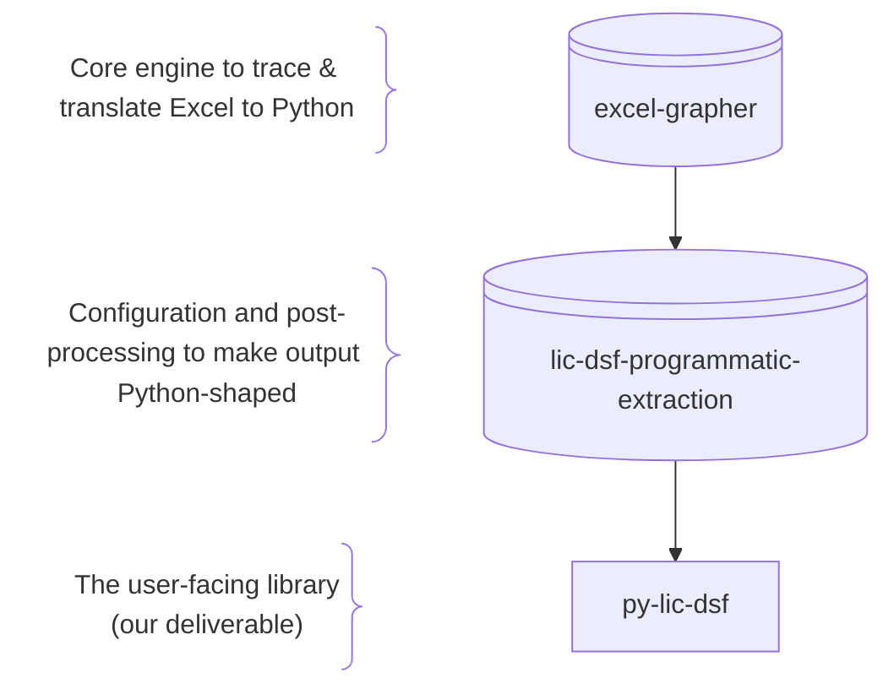
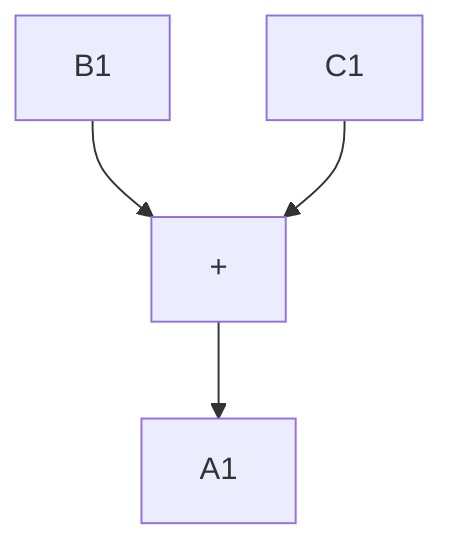
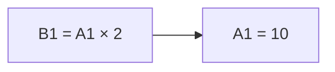
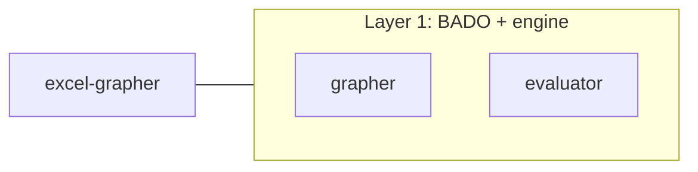
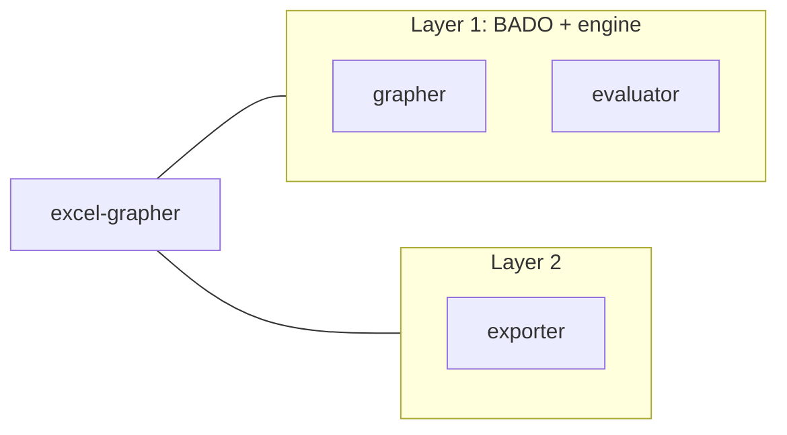

## Executive Summary

The problem:
The LIC DSF is powerful — but all the logic is locked inside the Excel workbook. Our goal is to duplicate it as a Python tool that can live alongside the workbook.

docs/pipeline-explainer/Friendship_Between_Excel_and_Python.mp4

The LIC DSF expects user input. But users could type *anything* into input cells. In Excel, you can't *guard* against bad inputs or *alert* the user they've made an error.

Running alternative scenarios in Excel requires laboriously changing inputs and then checking output cells. And what if you want to run 100 scenarios? This *doesn't scale*.

How does data flow through the workbook? Are the calculations even right? In Excel, it's very hard to tell. We can't easily *step through* the formulas or *test* that they're correct.

A Python library solves this. In Python, 
- We can *validate* inputs and raise an error if something's wrong.
- We can run, *in parallel*, any scenarios we want.
- We can *test* and *audit* all computation to make sure that nothing breaks.

But how do we make sure a Python library is true to the template in Excel? That's a big challenge. The LIC DSF:

[Cycle through bullets one per slide, with transition animation]
- has over *800,000 cells*, including *200,000 formula cells*
- calls *55 unique functions*, nested up to *7 levels* deep

We initially tried to brute-force our way to a Python version with AI agents, but the models aren't *good enough* or *predictable enough*. They made mistakes and produced chaotic output shapes. 

The solution in one sentence:
We *trace* what each cell depends on and *translate* the formulas to Python according to *mechanical rules*.

This is much harder than it sounds, but AI agents help make it tractable. Instead of using AI to write the translation, we use AI to write a *mechanical translation engine*.

The lesson:
For results you can trust, reproduce, and audit, *don't AI-generate the code*. *AI-generate the code that generates the code*.

## Deep Dive

Architecture:


[Zoom effect to excel-grapher if possible (zoom to upper-third of screen with fade and replace, maybe?)]

Let's start with the core engine. How do we mechanically trace & translate Excel to Python?


The Excel template is architected as a big-ass data object (BADO) plus a stable engine that knows how to interpret and compute that object.

```mermaid
flowchart LR
    A@{ img: "/home/chriscarrollsmith/Documents/Software/Excel_Extraction/lic-dsf-programmatic-extraction/docs/pipeline-explainer/excel-xlsm-icon.svg", label: "Excel workbook", h: 80, constraint: "on" }
    B@{ img: "/home/chriscarrollsmith/Documents/Software/Excel_Extraction/lic-dsf-programmatic-extraction/docs/pipeline-explainer/excel-app-icon.svg", label: "Excel application", h: 80, constraint: "on" }
    A ~~~ B
```

It's mostly a solved problem to replicate this BADO + engine approach in Python.

```mermaid
flowchart TB
    A@{ img: "/home/chriscarrollsmith/Documents/Software/Excel_Extraction/lic-dsf-programmatic-extraction/docs/pipeline-explainer/excel-xlsm-icon.svg", label: "Excel workbook", h: 80, constraint: "on" }
    B@{ img: "/home/chriscarrollsmith/Documents/Software/Excel_Extraction/lic-dsf-programmatic-extraction/docs/pipeline-explainer/excel-app-icon.svg", label: "Excel application", h: 80, constraint: "on" }
    C@{ shape: cyl, label: "Python dictionary" }
    D@{ shape: lin-rect, label: "Excel emulator"}
    A --> C
    B --> D
```

The workbook becomes a *Python dictionary* where every *cell* is an entry with its *formula* and *value* keyed to the *address* of the cell:

```python
xlsm_contents = {
    "Sheet1!A1": {
        "formula": "=B1+C1",
        "value": 5
    }
}
```

The *engine* gets implemented as what's called an *abstract syntax tree parser* (AST parser): a small program that can break down an Excel formula into a branching tree of operations and translate each operation into a Python equivalent. Thankfully, we can borrow from smart people like the creator of the *formulas* library who already mostly built this part!

Simple example AST:


The hard parts of implementing BADO + engine:
- If we only want particular output cells, how do we limit our extraction to only the relevant inputs?
- What sequence do you compute the cells in?
We solve these problems by building a *graph* of relationships between cells.

For any cell we care about (e.g. a stress-test result), we ask: *which other cells does its formula use?* We repeat until we hit numbers or text. That gives us a *dependency graph*.

We call this *target-driven dependency tracing*. Give `excel-grapher` a target cell; it follows the formula references until it reaches leaves. The result is a graph of *nodes (cells)* and *edges (depends-on)*.

Smallest example: the two-cell demo:

| A1 | B1 |
|----|----|
| 10 | =A1 × 2 |

B1 depends on A1. The graph is *two nodes* and *one edge*. If B1 is our *target*, A1 is the *leaf*. We need to extract A1 to compute B1, but we don't need C1 (or any other cells).



BADO + evaluator is the first layer of excel-grapher. *It already works today.* We can run the workbook this way and get results — and because the translation is mechanical, we can *guarantee correctness* by comparing every output cell against Excel's own results.



Limitations of the first layer:
- *Poor separation of concerns* — formulas live in the data layer, so data and economic logic are mixed in one big structure.
- *Non-transparent economic logic* — the model is 200,000 atomic operations; neither readable nor maintainable.

These limitations are fine for verifying correctness, but not for delivering a tool economists would actually want to use. What we want in a Python library: the *data layer* holds constants and inputs; *computational logic* lives as code.

The hard case: dynamic references. Some Excel functions — like OFFSET, INDEX, and INDIRECT — don't just compute values; they *navigate the spreadsheet itself*. They're tightly coupled to Excel's data model, and their arguments are theoretically *unbounded*: as the user changes inputs, they could point to any range of cells. This is one case where static analysis isn't enough. You need to understand *workbook intent* and exercise some intelligence to introduce *sensible bounds* that aren't present in Excel.

That brings us to the second layer: the *exporter* module.



The exporter turns formula cells into *Python functions* and outputs them, along with relevant parts of the engine, as a standalone Python library. Non-formula cells stay as a Python dictionary. That gives us a clear split: *data* in the dictionary, *logic* in code.

The exporter is *configurable*:
- Specify *targets* (which outputs you want) → it generates functions that produce those outputs.
- Specify how to *group inputs* → it generates setters for those groups.
- Mark cells as *constants* (used in the computation but not user-settable) so they stay out of the public API.

Configuration as guardrails:
- Define what *type* of data each input expects (a number, a date, a country from a fixed list) so the library can *validate* inputs and reject bad data immediately.
- Define *constraints* on inputs that affect dynamic references (like OFFSET) so they're not unbounded.

Configuration is where *domain knowledge* belongs: which cells are inputs, which are outputs, which are internal constants, types and constraints. We're adding information to the Excel template based on our understanding of workbook *intent*. This configuration lives in the `lic-dsf-programmatic-extraction` repository.

The exporter *also already works today*. We have a generated Python library that takes user inputs, runs the LIC DSF calculations, and produces outputs — all without Excel.

Where we're headed:
- Today we still have *one function per formula cell*.
- Goal: *one function per economic model concept*.
- We'll use *static analysis* and *graph analysis* to find groups of functions that should be collapsed. Most of that post-processing will live in `lic-dsf-programmatic-extraction`; some may be reusable in `excel-grapher`.

One thing to remember:
We *trace* dependencies, *translate* formulas, *configure* and shape the output, and *ship* a library. The rest is detail.

Don't AI-generate the code. AI-generate the code that generates the code.
